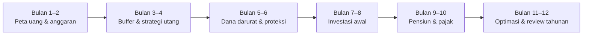
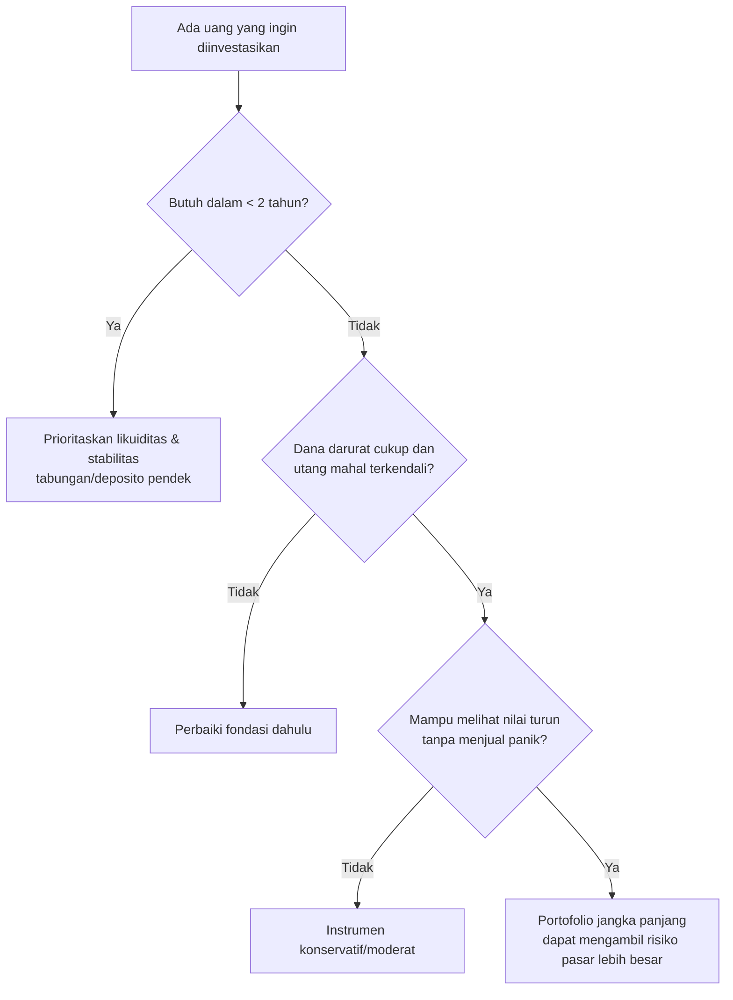

# Panduan Dasar Keuangan Pribadi untuk Pemula di Indonesia

## Ringkasan eksekutif

Keuangan pribadi adalah cara mengelola **pendapatan, pengeluaran, aset, utang, perlindungan risiko, pajak, dan investasi** agar kebutuhan hari ini terpenuhi tanpa mengorbankan tujuan masa depan. Bagi pemula, urutannya lebih penting daripada mengejar produk dengan imbal hasil tertinggi: **ketahui arus kas → buat anggaran → bangun dana darurat → kendalikan utang mahal → lindungi risiko besar → investasi teratur → siapkan pensiun dan pajak**. OJK menyediakan ekosistem edukasi seperti Sikapi Uangmu, layanan iDebKu/SLIK untuk informasi debitur, serta kanal perlindungan konsumen; ini menjadikannya titik awal yang lebih aman daripada mengandalkan promosi media sosial. citeturn19view11turn19view5

Untuk dana darurat, rujukan Kementerian Keuangan menyebut kisaran **3–6 kali pengeluaran bulanan bagi yang belum menikah dan 6–12 kali bagi yang berkeluarga**. Angka itu sebaiknya dihitung dari *pengeluaran esensial*, bukan seluruh gaya hidup. Orang dengan pendapatan tidak tetap, satu pencari nafkah, tanggungan besar, atau risiko kehilangan pekerjaan tinggi sebaiknya berada di sisi atas kisaran tersebut. citeturn19view2

Untuk tabungan bank dan deposito, perlindungan LPS mempunyai syarat; jumlah simpanan yang dijamin maksimal **Rp2 miliar per nasabah per bank**. Salah satu syarat penting adalah bunga yang diterima tidak melebihi Tingkat Bunga Penjaminan LPS. Untuk periode 1 Juli–30 September 2026, TBP simpanan rupiah bank umum adalah **3,75%**, sementara BPR **6,25%**; angka tersebut adalah **batas bunga penjaminan, bukan prediksi hasil investasi** dan dapat berubah pada periode berikutnya. citeturn8search0turn8search1turn8search13

Dalam investasi, pemula sebaiknya mencocokkan instrumen dengan jangka waktu dan kemampuan menanggung kerugian, bukan memilih berdasarkan “return tertinggi”. Tabungan/deposito cocok untuk likuiditas, reksa dana memiliki risiko yang berbeda menurut aset dasarnya, ETF diperdagangkan di bursa, sedangkan SBN ritel merupakan instrumen pembiayaan APBN yang diterbitkan pemerintah. Sebagai konteks daya beli, inflasi Indonesia pada Agustus 2026 tercatat **3,19% year-on-year**, sehingga yang relevan dalam jangka panjang bukan sekadar imbal hasil nominal tetapi juga hasil setelah biaya, pajak, dan inflasi. citeturn1search3turn19view0turn13search2

Untuk pajak, tarif PPh orang pribadi Indonesia bersifat progresif: **5%, 15%, 25%, 30%, dan 35%** menurut lapisan Penghasilan Kena Pajak (PKP). PTKP dasar yang berlaku adalah **Rp54 juta per tahun**, dengan tambahan tertentu untuk status kawin dan tanggungan. SPT Tahunan PPh untuk Tahun Pajak 2025 dan seterusnya dilaporkan melalui Coretax DJP. citeturn19view6turn19view7turn19view8

**Aturan praktis utama panduan ini:** jangan mulai dengan bertanya “investasi apa yang paling untung?” Mulailah dengan bertanya, **“apakah satu kejadian buruk—PHK, sakit, kendaraan rusak, atau tagihan mendadak—akan memaksa saya berutang?”** Jika jawabannya ya, fondasi kas dan perlindungan perlu didahulukan.

## Fondasi dan prinsip inti

### Peta keuangan pribadi

Sepuluh konsep berikut adalah “bahasa dasar” yang perlu dipahami sebelum membeli produk keuangan.

| Konsep | Arti sederhana | Tindakan pertama |
|---|---|---|
| **Anggaran** | Rencana ke mana pendapatan akan dialokasikan | Catat seluruh pendapatan dan pengeluaran selama 30 hari |
| **Menabung** | Menyisihkan uang untuk kebutuhan jangka pendek/menengah | Transfer otomatis sesaat setelah menerima penghasilan |
| **Dana darurat** | Uang untuk kejadian penting yang tidak direncanakan | Bangun bertahap menuju 3–12 bulan biaya esensial |
| **Manajemen utang** | Mengendalikan bunga, cicilan, dan jadwal pembayaran | Daftar saldo, bunga efektif/APR, cicilan minimum, jatuh tempo |
| **Riwayat kredit** | Catatan kewajiban kredit dan pembayaran yang membantu lembaga keuangan menilai debitur | Periksa iDeb/SLIK dan bayar kewajiban tepat waktu |
| **Asuransi** | Pemindahan risiko kerugian besar yang sulit ditanggung sendiri | Pastikan perlindungan kesehatan; tambah jiwa bila ada tanggungan |
| **Investasi** | Menempatkan uang dengan menerima risiko demi potensi pertumbuhan | Investasikan uang yang tidak dibutuhkan segera |
| **Pensiun** | Pendanaan kebutuhan saat penghasilan kerja berkurang/berhenti | Periksa JHT/JP dan tambahkan investasi pribadi bila perlu |
| **Pajak** | Kewajiban yang timbul dari penghasilan/transaksi sesuai aturan | Simpan bukti potong dan data aset; pahami Coretax |
| **Tujuan keuangan** | Target yang memiliki nominal dan tenggat | Nyatakan tujuan sebagai “RpX pada bulan/tahun Y” |

Di Indonesia, istilah “credit score” tidak sebaiknya disamakan mentah-mentah dengan sistem skor konsumen di Amerika Serikat. OJK menjelaskan bahwa **SLIK** digunakan antara lain untuk penyediaan dana, manajemen risiko kredit/pembiayaan, dan penilaian kualitas debitur; debitur dapat meminta Informasi Debitur miliknya sendiri secara daring melalui layanan OJK. Dengan demikian, bagi pemula fokus yang tepat adalah menjaga catatan pembayaran tetap baik dan memeriksa kebenaran data SLIK, sembari memahami bahwa masing-masing pemberi pinjaman masih dapat memakai model penilaiannya sendiri. citeturn19view5

### Lima angka yang perlu Anda ketahui

Tidak diperlukan aplikasi rumit. Lima formula berikut sudah cukup sebagai “dashboard” awal.

**Arus kas bulanan**

\[
\text{Arus kas} = \text{pendapatan bersih} - \text{seluruh pengeluaran}
\]

Target pertama adalah membuat hasilnya **positif secara konsisten**.

**Kekayaan bersih**

\[
\text{Net worth} = \text{total aset} - \text{total kewajiban}
\]

Rumah senilai Rp800 juta dengan sisa KPR Rp600 juta, misalnya, berkontribusi Rp200 juta sebelum mempertimbangkan biaya transaksi dan faktor lain.

**Tingkat tabungan**

\[
\text{Savings rate} =
\frac{\text{tabungan + investasi}}{\text{pendapatan bersih}}
\times 100\%
\]

Gunakan definisi yang konsisten dari bulan ke bulan. Dana yang hanya “tersisa tanpa tujuan” sebaiknya tidak dihitung sampai benar-benar dipisahkan.

**Rasio pembayaran utang pribadi**

\[
\text{Debt-payment ratio} =
\frac{\text{total cicilan wajib bulanan}}{\text{pendapatan bersih}}
\times100\%
\]

Ini berguna sebagai indikator internal, **bukan batas regulator universal**. Semakin besar proporsi pendapatan yang sudah terkunci untuk cicilan, semakin sedikit ruang untuk keadaan darurat.

**Target dana darurat**

\[
\text{Dana darurat}=
\text{pengeluaran esensial bulanan}\times\text{jumlah bulan target}
\]

### Cara menetapkan tujuan

Gunakan tiga horizon:

| Horizon | Contoh | Tempat uang secara umum |
|---|---|---|
| **< 2 tahun** | Dana darurat, laptop, biaya pindah | Kas/tabungan/deposito pendek |
| **2–5 tahun** | Uang muka, pendidikan tertentu | Instrumen konservatif–moderat sesuai toleransi risiko |
| **> 5 tahun** | Pensiun, kekayaan jangka panjang | Portofolio investasi lebih berorientasi pertumbuhan bila mampu menanggung volatilitas |

Batas tersebut merupakan **kerangka perencanaan**, bukan jaminan bahwa suatu aset akan positif dalam periode tertentu. Prinsip yang penting adalah: semakin dekat uang akan digunakan, semakin kecil kemampuan Anda menunggu pemulihan setelah penurunan pasar.

## Sistem anggaran, template, dan kalkulator

### Metode 50/30/20

Kerangka 50/30/20 mengalokasikan sekitar **50% pendapatan untuk kebutuhan, 30% keinginan, dan 20% tabungan/tujuan masa depan**. Ini adalah panduan, bukan hukum; bagi rumah tangga berpendapatan rendah, kebutuhan dasar dapat dengan mudah menghabiskan lebih dari 50%. citeturn12search13

\[
\text{Kebutuhan}=0{,}50\times\text{take-home pay}
\]

\[
\text{Keinginan}=0{,}30\times\text{take-home pay}
\]

\[
\text{Tabungan/investasi}=0{,}20\times\text{take-home pay}
\]

| Pendapatan bersih | 50% kebutuhan | 30% keinginan | 20% tabungan/investasi |
|---:|---:|---:|---:|
| Rp5.000.000 | Rp2.500.000 | Rp1.500.000 | Rp1.000.000 |
| Rp12.000.000 | Rp6.000.000 | Rp3.600.000 | Rp2.400.000 |
| Rp30.000.000 | Rp15.000.000 | Rp9.000.000 | Rp6.000.000 |

**Kelebihan:** sangat mudah dimulai, sedikit kategori, cepat mengecek ketidakseimbangan.

**Kekurangan:** 50% kebutuhan sering tidak realistis di kota mahal atau bagi pendapatan kecil; “30% keinginan” dapat terlalu besar bagi orang yang sedang mengejar pelunasan utang; tidak menangani pengeluaran tahunan secara rinci.

**Adaptasi yang lebih berguna:** jangan memaksa 50/30/20 bila sewa dan makanan sudah 60–70%. Pertahankan hidup layak, tekan kategori fleksibel, lalu tingkatkan porsi tabungan secara bertahap ketika pendapatan bertambah atau utang selesai.

### Zero-based budgeting

Prinsipnya:

\[
\text{Pendapatan}-\text{semua alokasi}=Rp0
\]

“Rp0” **bukan berarti menghabiskan seluruh uang**. Tabungan, investasi, dana darurat, dan sinking fund juga diberi “pekerjaan”.

Contoh pendapatan Rp10 juta:

> Rp5,5 juta kebutuhan + Rp1 juta cicilan + Rp1 juta dana darurat + Rp1 juta investasi + Rp500 ribu sinking fund + Rp1 juta rekreasi = Rp10 juta.

**Kelebihan:** kontrol paling kuat; sangat baik untuk keluar dari utang, pendapatan ketat, atau orang yang selalu bertanya “uang saya habis ke mana?”

**Kekurangan:** perlu pembaruan lebih sering dan terasa merepotkan bila ada banyak transaksi atau pendapatan sangat berubah-ubah.

Untuk pekerja lepas, lakukan zero-based berdasarkan **“pendapatan dasar konservatif”**, misalnya angka yang hampir selalu bisa diperoleh; ketika pendapatan aktual lebih tinggi, buat aturan terlebih dahulu untuk membagi kelebihannya.

### Metode envelope/amplop

Tetapkan plafon per kategori:

\[
\text{Sisa amplop}=
\text{alokasi kategori}-\text{realisasi pengeluaran}
\]

Contoh: amplop makan di luar Rp600.000. Setelah terpakai Rp475.000, sisa bulan itu Rp125.000. Metodenya dapat berupa uang tunai, rekening terpisah, dompet digital terpisah, atau sekadar kategori di spreadsheet.

**Kelebihan:** sangat efektif untuk kategori yang mudah “bocor”, seperti makan di luar, belanja, hiburan, dan transportasi daring.

**Kekurangan:** kurang praktis untuk puluhan kategori dan tidak otomatis menyelesaikan masalah biaya tetap yang memang terlalu tinggi.

### Template anggaran bulanan

Salin format ini ke spreadsheet:

| Kategori | Anggaran | Aktual | Selisih |
|---|---:|---:|---:|
| Pendapatan bersih |  |  |  |
| Tempat tinggal |  |  |  |
| Makanan pokok |  |  |  |
| Listrik/air/internet/telepon |  |  |  |
| Transportasi |  |  |  |
| Kesehatan/asuransi |  |  |  |
| Cicilan minimum |  |  |  |
| Dana darurat |  |  |  |
| Investasi/pensiun |  |  |  |
| Sinking fund/tujuan |  |  |  |
| Keinginan/hiburan |  |  |  |
| **Total pengeluaran/alokasi** |  |  |  |
| **Sisa** |  |  |  |

Formula spreadsheet:

```text
Selisih kategori = Anggaran - Aktual
Total pengeluaran = SUM(seluruh aktual pengeluaran)
Arus kas = Pendapatan bersih - Total pengeluaran
Savings rate = (Dana darurat + Tabungan tujuan + Investasi) / Pendapatan bersih
```

### Contoh untuk tiga tingkat pendapatan

Kategori “rendah, menengah, tinggi” di bawah **hanya skenario ilustratif**, bukan klasifikasi pendapatan resmi Indonesia. Angka menggunakan *take-home pay* bulanan; sesuaikan dengan kota, rumah tangga, fasilitas dari perusahaan, dan harga aktual.

| Pos per bulan | Rp5 juta | Rp12 juta | Rp30 juta |
|---|---:|---:|---:|
| Tempat tinggal | Rp1.200.000 | Rp2.500.000 | Rp6.000.000 |
| Makanan pokok | Rp1.300.000 | Rp1.800.000 | Rp3.000.000 |
| Utilitas & komunikasi | Rp350.000 | Rp600.000 | Rp1.000.000 |
| Transportasi | Rp500.000 | Rp1.000.000 | Rp2.000.000 |
| Kesehatan/asuransi | Rp250.000 | Rp500.000 | Rp1.000.000 |
| Cicilan utang minimum | Rp300.000 | Rp600.000 | Rp1.000.000 |
| Dana darurat | Rp500.000 | Rp1.000.000 | Rp2.000.000 |
| Investasi/pensiun | Rp200.000 | Rp1.200.000 | Rp6.000.000 |
| Sinking fund/tujuan | — | Rp800.000 | Rp2.000.000 |
| Keinginan/hiburan | Rp400.000 | Rp2.000.000 | Rp6.000.000 |
| **Total** | **Rp5.000.000** | **Rp12.000.000** | **Rp30.000.000** |

Ada tiga pelajaran penting dari contoh tersebut.

Pertama, **rumah tangga berpendapatan Rp5 juta tidak perlu merasa “gagal” karena kebutuhan melebihi 50%**. Prioritasnya adalah arus kas positif dan membangun bantalan, bukan memaksa rasio yang tidak sesuai kenyataan.

Kedua, kenaikan pendapatan sebaiknya tidak seluruhnya berubah menjadi kenaikan gaya hidup. Dalam contoh Rp30 juta, 20% pendapatan langsung diarahkan ke investasi dan tambahan Rp2 juta ke dana darurat.

Ketiga, *sinking fund* berbeda dengan dana darurat. Servis kendaraan tahunan, mudik, pajak kendaraan, premi tahunan, uang sekolah yang sudah diketahui, atau penggantian laptop adalah **pengeluaran yang dapat diperkirakan** dan sebaiknya dicicil dalam sinking fund:

\[
\text{Setoran sinking fund per bulan}
=
\frac{\text{biaya yang diperkirakan}}{\text{bulan sampai jatuh tempo}}
\]

Pajak kendaraan Rp3,6 juta lagi 12 bulan berarti sisihkan Rp300.000 per bulan—bukan memakai dana darurat saat jatuh tempo.

## Rencana aksi dua belas bulan dari nol

Tujuannya bukan menjadi “sempurna” dalam setahun, tetapi pada bulan ke-12 memiliki sistem yang tetap berjalan tanpa mengandalkan motivasi harian.



| Bulan | Milestone | Langkah konkret | Ukuran selesai |
|---|---|---|---|
| **1** | Ketahui posisi awal | Catat penghasilan, 30 hari pengeluaran, saldo rekening, seluruh utang, aset dan tagihan | Ada satu lembar *net worth* + arus kas |
| **2** | Pasang sistem anggaran | Pilih 50/30/20, zero-based, atau envelope; pisahkan uang tagihan dan tabungan | Semua rupiah mempunyai kategori |
| **3** | Buat buffer awal | Transfer otomatis setelah hari gajian; target awal praktis Rp1–2 juta atau nominal yang mencegah utang kecil | Pengeluaran mendadak kecil tidak memakai paylater |
| **4** | Kendalikan utang | Autopay minimum; pilih avalanche atau snowball; hentikan penambahan utang konsumtif | Tidak ada pembayaran terlambat |
| **5** | Dana darurat satu bulan | Hitung pengeluaran esensial dan capai sekitar 1 bulan secara bertahap | Dana disimpan terpisah dan likuid |
| **6** | Audit proteksi | Pastikan status JKN dan BPJS Ketenagakerjaan sesuai kondisi; evaluasi kebutuhan asuransi tambahan | Risiko kesehatan/jiwa utama dipetakan |
| **7** | Naikkan bantalan | Bergerak menuju 2–3 bulan biaya esensial; buat sinking fund tahunan | Tagihan tahunan tidak menjadi “darurat” |
| **8** | Mulai investasi sederhana | Untuk uang jangka panjang, pilih produk legal yang dipahami dan mulai dengan nominal kecil | Investasi rutin aktif, bukan spekulasi |
| **9** | Rencana pensiun | Cek JHT/JP dan proyeksikan kebutuhan pensiun; tentukan setoran tambahan | Ada target pensiun bulanan |
| **10** | Rapikan pajak | Aktifkan/cek Coretax, arsipkan bukti potong, rekening dan daftar investasi/aset | Dokumen pajak terkumpul |
| **11** | Optimasi | Review biaya rekening, premi, langganan, bunga utang, alokasi investasi | Ada minimal satu biaya yang dipangkas/dioptimalkan |
| **12** | Audit tahunan | Hitung net worth, savings rate, saldo utang, dana darurat dan tujuan tahun berikutnya | Target 12 bulan baru tertulis |

Untuk bulan ke-6 dan ke-9, BPJS Ketenagakerjaan menyediakan program JHT dan JP bagi pekerja penerima upah, sementara kategori bukan penerima upah juga memiliki akses ke beberapa program perlindungan; situs BPJS Ketenagakerjaan juga menyediakan simulasi JHT dan JP. citeturn19view10

Untuk bulan ke-10, Coretax telah menjadi sistem untuk SPT Tahunan PPh Tahun Pajak 2025 dan seterusnya. DJP juga menekankan pentingnya aktivasi akun dan kode otorisasi/sertifikat elektronik untuk proses pelaporan. citeturn19view8turn14search27

Urutan investasi pada bulan ke-8 **bukan berarti semua orang harus menunggu delapan bulan**. Bila seseorang sudah bebas dari utang mahal dan mempunyai dana darurat cukup, investasi bisa dimulai lebih awal. Sebaliknya, bila masih menanggung utang berbunga sangat tinggi, pengembalian yang “diperoleh” dari melunasi bunga tersebut dapat membuat pelunasan menjadi prioritas yang lebih masuk akal daripada menambah investasi berisiko.

## Dana darurat, utang, kredit, dan perlindungan

### Dana darurat

Rujukan Kementerian Keuangan menyebut **3–6 kali pengeluaran bulanan untuk yang belum menikah dan 6–12 kali untuk yang sudah berkeluarga**. Dana tersebut ditujukan untuk peristiwa tidak terduga seperti gangguan kesehatan atau perbaikan mendesak. citeturn19view2

Kerangka yang lebih praktis:

| Kondisi | Target yang masuk akal | Mengapa |
|---|---:|---|
| Lajang, pekerjaan sangat stabil, tanpa tanggungan | 3–6 bulan | Risiko kewajiban rumah tangga relatif rendah |
| Dua pencari nafkah, penghasilan stabil | 4–6 bulan | Ada diversifikasi sumber pendapatan |
| Keluarga dengan anak | 6–9 bulan | Lebih banyak biaya wajib |
| Satu pencari nafkah untuk keluarga | 9–12 bulan | Kehilangan satu pendapatan berarti kehilangan seluruh pendapatan kerja |
| Freelancer/pengusaha dengan penghasilan sangat berubah | 9–12 bulan | Risiko penurunan pendapatan lebih tinggi |
| Kondisi kesehatan/pekerjaan berisiko tinggi | Cenderung ke 12 bulan | Potensi gangguan penghasilan atau biaya lebih besar |

Baris selain rentang resmi Kemenkeu adalah **rekomendasi konservatif dalam panduan ini**, bukan batas regulator.

Misalnya pengeluaran esensial Rp6 juta:

| Target | Perhitungan | Dana |
|---:|---:|---:|
| 3 bulan | Rp6 jt × 3 | Rp18 juta |
| 6 bulan | Rp6 jt × 6 | Rp36 juta |
| 9 bulan | Rp6 jt × 9 | Rp54 juta |
| 12 bulan | Rp6 jt × 12 | Rp72 juta |

“Esensial” mencakup antara lain tempat tinggal, makan dasar, utilitas, transportasi kerja, obat/kesehatan, premi penting, dan cicilan minimum. Tidak perlu memasukkan liburan atau belanja rekreasi penuh.

**Tempat menyimpan:** bagian inti dana darurat sebaiknya likuid dan tidak bergantung pada kenaikan harga pasar agar bisa dicairkan ketika keadaan buruk. Tabungan bank yang memenuhi syarat LPS adalah salah satu pilihan. LPS menjamin paling banyak Rp2 miliar per nasabah per bank dengan persyaratan penjaminan, termasuk ketentuan mengenai tingkat bunga. citeturn8search1turn8search13

### Cara menangani utang

Buat tabel utang seperti ini sebelum membayar ekstra:

| Utang | Saldo | Bunga/tahun | Minimum | Jatuh tempo |
|---|---:|---:|---:|---|
| A | … | …% | … | … |
| B | … | …% | … | … |
| C | … | …% | … | … |

Kemudian:

1. Bayar minimum seluruh utang tepat waktu.
2. Sisakan buffer kas agar kejadian kecil tidak menciptakan utang baru.
3. Arahkan seluruh pembayaran ekstra ke satu utang target.
4. Setelah lunas, pindahkan seluruh pembayarannya ke target berikutnya.
5. Jangan menambah saldo baru kecuali benar-benar diperlukan.

### Snowball versus avalanche

**Snowball:** targetkan saldo terkecil terlebih dahulu. Keunggulan utamanya adalah kemenangan psikologis lebih cepat.

**Avalanche:** targetkan tingkat bunga tertinggi terlebih dahulu. Bila parameter lain sama, pendekatan ini secara matematis meminimalkan bunga karena uang ekstra diarahkan ke utang yang paling mahal.

Contoh sederhana:

| Utang | Saldo awal | Bunga p.a. | Minimum |
|---|---:|---:|---:|
| Paylater A | Rp2.000.000 | 24% | Rp200.000 |
| Kartu kredit B | Rp5.000.000 | 30% | Rp300.000 |
| Pinjaman C | Rp10.000.000 | 12% | Rp500.000 |
| **Anggaran total pelunasan** |  |  | **Rp2.000.000/bulan** |

Total minimum = Rp1 juta sehingga tersedia Rp1 juta tambahan.

**Bulan pertama dengan snowball:**

- A: Rp1.200.000
- B: Rp300.000
- C: Rp500.000

**Bulan pertama dengan avalanche:**

- A: Rp200.000
- B: Rp1.300.000
- C: Rp500.000

Dengan simulasi sederhana yang membebankan bunga bulanan sebesar APR/12, minimum tetap, tidak ada transaksi baru/biaya tambahan, dan seluruh pembayaran yang terbebas digulirkan:

| Strategi | Perkiraan lunas | Total bunga simulasi |
|---|---:|---:|
| Snowball | 10 bulan | ±Rp1.184.730 |
| Avalanche | 10 bulan | ±Rp1.154.324 |
| **Keuntungan avalanche** | sama-sama 10 bulan | **±Rp30.406 lebih sedikit** |

Contoh ini sengaja sederhana; kredit nyata dapat memiliki bunga harian, biaya, perubahan pembayaran minimum, penalti atau struktur angsuran yang berbeda. Gunakan **bunga efektif dan syarat kontrak sebenarnya** saat membuat keputusan.

**Pilihan praktis:** gunakan avalanche bila disiplin Anda kuat; gunakan snowball bila keberhasilan kecil membuat Anda lebih mungkin bertahan. Strategi yang dijalankan selama setahun lebih baik daripada strategi “optimal” yang dihentikan setelah dua minggu.

### Riwayat kredit dan SLIK

OJK menyatakan SLIK dapat digunakan dalam proses penyediaan dana, manajemen risiko kredit/pembiayaan, dan penilaian kualitas debitur. Anda berhak meminta Informasi Debitur sendiri kepada OJK atau pelapor SLIK yang memberikan fasilitas dana, termasuk secara daring. citeturn19view5

Karena itu:

- bayar sebelum jatuh tempo;
- jangan menganggap limit kredit sebagai tambahan pendapatan;
- periksa iDeb secara berkala, terutama sebelum mengajukan KPR/kredit besar;
- jika ada data yang menurut Anda salah, tangani melalui lembaga pemberi kredit/kanal resmi, bukan membayar pihak yang menjanjikan “menghapus skor”.

### Asuransi: lindungi kerugian besar, bukan setiap kerugian kecil

Asuransi paling bernilai untuk peristiwa yang **probabilitasnya mungkin rendah tetapi dampaknya dapat menghancurkan keuangan**.

Prioritas praktis bagi pemula:

| Risiko | Perlindungan dasar yang dipertimbangkan | Siapa yang paling membutuhkan |
|---|---|---|
| Biaya kesehatan besar | JKN/BPJS Kesehatan; asuransi swasta dapat menjadi pelengkap sesuai kebutuhan | Hampir semua orang |
| Kematian pencari nafkah | Asuransi jiwa berjangka/produk perlindungan yang dipahami | Orang dengan pasangan/anak/orang tua yang bergantung pada penghasilannya |
| Kecelakaan/ketidakmampuan bekerja | BPJS Ketenagakerjaan dan/atau perlindungan tambahan sesuai pekerjaan | Pekerja dengan ketergantungan tinggi pada pendapatan aktif |
| Rumah/kendaraan/aset besar | Asuransi aset bila kerugiannya sulit ditanggung sendiri atau diwajibkan kontrak | Pemilik aset bernilai besar |

Mobile JKN merupakan aplikasi resmi BPJS Kesehatan yang antara lain mendukung pendaftaran peserta; panduan resminya juga mencakup layanan administrasi dan pencarian fasilitas kesehatan. citeturn19view9turn4search17turn4search29 BPJS Ketenagakerjaan mencantumkan JHT, JKK, JKM, JP dan JKP untuk pekerja penerima upah, dengan cakupan berbeda untuk kategori peserta lainnya. citeturn19view10

Untuk jiwa, daripada menggunakan aturan “10× gaji” secara buta, hitung kebutuhan:

\[
\text{Pertanggungan jiwa yang dibutuhkan}
\approx
\text{utang yang harus dilunasi}
+
\text{biaya hidup tanggungan selama N tahun}
+
\text{tujuan penting}
-
\text{aset likuid yang memang tersedia untuk keluarga}
\]

Contoh: utang Rp200 juta + kebutuhan keluarga Rp8 juta × 60 bulan + pendidikan Rp250 juta − aset likuid Rp150 juta = kebutuhan indikatif sekitar **Rp780 juta** sebelum mempertimbangkan inflasi dan faktor lain.

Sebelum membeli polis, pahami **manfaat, pengecualian, masa tunggu, batas manfaat, premi yang dapat berubah, deductible/co-payment bila ada, prosedur klaim, dan konsekuensi penghentian polis**. Perlindungan yang sederhana dan dipahami biasanya merupakan fondasi yang lebih baik daripada membeli produk kompleks semata karena ilustrasi hasil investasi.

## Investasi, pensiun, dan pajak Indonesia

### Sebelum berinvestasi

Lewati pertanyaan “produk apa yang paling cuan?” dan gunakan urutan ini:



Jangan memakai dana darurat untuk membeli aset volatil. Dan jangan meminjam hanya untuk berinvestasi apabila Anda belum benar-benar memahami risiko leverage.

### Opsi investasi pemula

| Instrumen | Risiko modal | Potensi hasil | Likuiditas | Penggunaan utama |
|---|---|---|---|---|
| **Tabungan bank** | Sangat rendah bila memenuhi syarat LPS dan di bawah batas jaminan | Rendah, bunga berubah | Sangat tinggi | Transaksi & dana darurat |
| **Deposito** | Sangat rendah dengan syarat LPS; ada risiko likuiditas | Rendah–moderat, umumnya ditentukan untuk tenor | Rendah–menengah | Dana dengan tanggal penggunaan relatif jelas |
| **Reksa dana** | Rendah hingga tinggi tergantung aset dasar | Rendah hingga tinggi | Umumnya cukup likuid tetapi tidak seketika seperti kas | Diversifikasi tanpa memilih setiap surat berharga sendiri |
| **ETF** | Bergantung aset/indeks; nilai pasar dapat turun | Mengikuti kinerja aset/indeks setelah biaya/tracking | Diperdagangkan di bursa | Diversifikasi dan investasi pasar secara transparan |
| **SBN pemerintah** | Risiko kredit pemerintah; harga seri tradable dapat berfluktuasi sebelum jatuh tempo | Kupon/imbal hasil sesuai seri | Berbeda menurut jenis/seri | Pendapatan dan diversifikasi jangka menengah |

LPS menetapkan batas penjaminan simpanan Rp2 miliar per nasabah per bank serta syarat bunga maksimum untuk penjaminan. Untuk 1 Juli–30 September 2026, TBP rupiah bank umum 3,75%; **deposito 5% tidak otomatis “lebih baik” bila konsekuensinya adalah bunga melampaui tingkat yang memenuhi kriteria penjaminan LPS**. Selalu cek periode terbaru sebelum membuka deposito. citeturn8search0turn8search1turn8search13

ETF di Bursa Efek Indonesia adalah produk yang menggabungkan karakteristik reksa dana dengan perdagangan di bursa; karena harganya mengikuti aset yang dimiliki/diacu, ETF **bukan deposito dan nilainya tidak dijamin naik**. citeturn1search3

Untuk SBN ritel, jangan berasumsi semua seri identik. Ada perbedaan tenor, struktur kupon/imbal hasil, apakah dapat diperdagangkan di pasar sekunder, serta fasilitas pencairan sebelum jatuh tempo. Contoh penerbitan pemerintah pada 2026 adalah ORI030; hasil penjualannya digunakan untuk pembiayaan APBN. citeturn19view0

**Urutan sederhana untuk pemula:** dana darurat → investasi sesuai tujuan → diversifikasi. Tidak ada kebutuhan untuk memiliki lima jenis produk sekaligus pada bulan pertama.

### Risiko dan return: gunakan hasil riil

Rumus sederhana:

\[
\text{Real return kira-kira}
\approx
\text{return setelah biaya/pajak}
-
\text{inflasi}
\]

Inflasi Indonesia Agustus 2026 sebesar 3,19% y/y. Jadi, misalnya hasil bersih suatu instrumen hanya 2% setahun sementara inflasi berada di sekitar 3%, nominal uang bertambah tetapi daya belinya secara kasar dapat menurun. citeturn13search2turn13search18

Jangan pula menyimpulkan bahwa solusinya selalu mengambil risiko tinggi: **uang yang akan digunakan tahun depan tidak memiliki waktu panjang untuk menunggu pasar pulih**.

### Pensiun

BPJS Ketenagakerjaan menyediakan JHT dan JP untuk kelompok peserta yang memenuhi ketentuan, serta kalkulator simulasi pada situs resminya. Jaminan sosial tersebut dapat diperlakukan sebagai **lapisan dasar**, tetapi kebutuhan pensiun pribadi tetap perlu dihitung dari gaya hidup dan sumber pendapatan masing-masing. citeturn19view10turn5search18

Perkiraan kebutuhan tahunan:

\[
\text{Belanja pensiun tahunan}
=
\text{belanja pensiun bulanan}\times12
\]

Untuk investasi satu kali:

\[
FV=P(1+r)^n
\]

Untuk setoran bulanan di akhir bulan:

\[
FV=PMT\times
\frac{(1+r_m)^N-1}{r_m}
\]

dengan:

- \(PMT\) = investasi bulanan,
- \(r_m\) = asumsi imbal hasil bulanan,
- \(N\) = jumlah bulan.

Contoh **murni ilustratif**, bukan proyeksi investasi: Rp1 juta/bulan selama 30 tahun pada rata-rata 7% per tahun dengan pendekatan 7%/12 per bulan menghasilkan sekitar **Rp1,22 miliar nominal**. Hasil aktual bisa jauh berbeda dan Rp1,22 miliar tiga dekade kemudian tidak memiliki daya beli yang sama dengan Rp1,22 miliar hari ini.

Kunci pensiun bagi pemula adalah **waktu dan konsistensi**, bukan menebak saham terbaik tahun depan. Setelah pendapatan naik, naikkan setoran pensiun sebelum seluruh kenaikan gaji berubah menjadi biaya hidup permanen.

### Pajak dasar untuk orang pribadi

Tarif PPh orang pribadi dalam negeri atas **Penghasilan Kena Pajak**, bukan seluruh pendapatan bruto, adalah: citeturn19view6

| Lapisan PKP | Tarif |
|---:|---:|
| Sampai Rp60 juta | 5% |
| > Rp60 juta–Rp250 juta | 15% |
| > Rp250 juta–Rp500 juta | 25% |
| > Rp500 juta–Rp5 miliar | 30% |
| > Rp5 miliar | 35% |

PTKP dasar yang berlaku adalah **Rp54 juta/tahun**, ditambah Rp4,5 juta untuk wajib pajak kawin dan Rp4,5 juta untuk setiap tanggungan yang memenuhi ketentuan, maksimal tiga tanggungan. PTKP mengurangi penghasilan neto untuk menentukan PKP; jangan salah membaca tarif 15%, misalnya, seolah-olah seluruh penghasilan langsung dikenai 15%. citeturn19view7

Contoh sangat sederhana, mengabaikan berbagai pengurang/ketentuan khusus: bila setelah perhitungan resmi PKP seseorang Rp100 juta, pajaknya bukan 15% × Rp100 juta. Penghitungan lapisannya:

\[
5\%\times Rp60juta +
15\%\times Rp40juta
= Rp9juta
\]

Itulah arti tarif **progresif**.

Bunga deposito/tabungan bagi wajib pajak dalam negeri pada kondisi yang dikenai ketentuan tersebut umumnya terkena **PPh final 20% dari jumlah bruto** menurut informasi DJP; karena pengecualian dan karakter tiap instrumen dapat berbeda, cek aturan aktual sebelum membuat kalkulasi pajak investasi. citeturn14search6 DJP juga menjelaskan bahwa keuntungan pemegang unit reksa dana tidak dikenai pajak secara langsung sebagai objek PPh investor dalam konteks yang dijelaskan pada ketentuan tersebut. citeturn14search3

Untuk administrasi, **Coretax digunakan untuk SPT Tahunan PPh orang pribadi Tahun Pajak 2025 dan seterusnya**, dengan sejumlah data seperti bukti potong dapat tersedia secara *prepopulated* untuk diverifikasi wajib pajak. citeturn19view8turn14search27 Secara umum, SPT Tahunan orang pribadi memiliki batas waktu tiga bulan setelah akhir tahun pajak—untuk tahun kalender berarti biasanya 31 Maret tahun berikutnya—kecuali terdapat kebijakan khusus untuk tahun tertentu. citeturn2search16

Praktiknya, buat satu folder tahunan berisi:

- bukti potong penghasilan;
- laporan penghasilan sampingan;
- saldo/aset dan kewajiban;
- dokumen investasi;
- transaksi yang mungkin memiliki konsekuensi pajak;
- bukti pembayaran pajak bila ada.

Tujuannya bukan membayar pajak sebanyak mungkin atau sesedikit mungkin, tetapi **melaporkan secara benar dan tidak kehilangan dokumen saat tenggat tiba**.

## Perilaku, alat gratis, kesalahan umum, dan checklist satu halaman

### Sistem perilaku yang lebih penting daripada kemauan

**Otomatiskan perilaku baik.** Transfer dana darurat/investasi satu atau dua hari setelah penghasilan masuk. Uang yang harus “diputuskan untuk ditabung” setiap akhir bulan jauh lebih mudah terpakai.

**Pisahkan fungsi rekening.** Minimal bedakan uang untuk transaksi/tagihan dengan dana darurat. Anda tidak memerlukan enam rekening; yang penting saldo untuk keadaan darurat tidak tampak seperti saldo yang bebas dibelanjakan.

**Buat friksi untuk pengeluaran impulsif.** Hapus kartu dari aplikasi belanja tertentu, gunakan aturan tunggu 24–48 jam untuk pembelian non-esensial, dan masukkan belanja impulsif ke *wish list* sebelum checkout.

**Batasi lifestyle inflation.** Saat gaji naik, tetapkan terlebih dahulu persentase kenaikan yang masuk ke tujuan keuangan. Contoh: kenaikan gaji Rp2 juta → Rp1 juta otomatis ke investasi/dana tujuan, sisanya boleh meningkatkan gaya hidup.

**Review singkat tetapi teratur.** Lima belas menit setiap minggu untuk transaksi abnormal dan 30–60 menit setiap akhir bulan biasanya lebih realistis daripada mencoba mencatat setiap rupiah dengan sempurna selamanya.

### Kesalahan yang paling merusak

| Kesalahan | Mengapa bermasalah | Ganti dengan |
|---|---|---|
| Investasi sebelum punya buffer | Penurunan kecil pendapatan dapat memaksa menjual investasi/berutang | Bangun buffer dan dana darurat |
| Menganggap limit kartu/paylater sebagai uang | Menaikkan konsumsi sekaligus kewajiban masa depan | Anggap limit sebagai fasilitas utang |
| Selalu bayar minimum utang mahal | Membuat bunga berjalan lebih lama | Tambah pembayaran dengan avalanche/snowball |
| Dana darurat dicampur uang liburan | Dana perlindungan habis untuk pengeluaran pilihan | Pisahkan emergency fund dan sinking fund |
| Memilih investasi dari return tahun lalu | Kinerja historis tidak menjamin periode berikutnya | Pilih berdasarkan tujuan, risiko, biaya dan horizon |
| Membeli asuransi tanpa membaca polis | Manfaat aktual dapat tidak sesuai ekspektasi | Cek manfaat, pengecualian, batas dan klaim |
| Menaikkan gaya hidup sebesar seluruh kenaikan gaji | Savings rate tidak pernah meningkat | Otomatiskan sebagian kenaikan |
| Mengabaikan pajak sampai Maret | Dokumen mudah hilang dan kesalahan sulit diperbaiki | Arsip sepanjang tahun |
| Mempercayai tawaran “return tinggi pasti” | Risiko penipuan/aktivitas ilegal | Verifikasi lembaga dan produk lewat kanal resmi OJK |

OJK menyediakan Sikapi Uangmu untuk edukasi, iDebKu untuk permohonan Informasi Debitur, APPK untuk perlindungan konsumen, Indonesia Anti-Scam Centre, serta kanal Satgas PASTI untuk aktivitas keuangan ilegal. citeturn19view11

### Alat dan aplikasi resmi berbahasa Indonesia

Layanan di bawah merupakan kanal pemerintah/regulator; penggunaan portal/aplikasinya tidak memerlukan pembelian aplikasi, walaupun biaya data/internet tentu dapat berlaku.

| Alat | Gunanya |
|---|---|
| **Sikapi Uangmu – OJK** | Edukasi literasi keuangan |
| **iDebKu / SLIK OJK** | Meminta Informasi Debitur sendiri |
| **APPK / Kontak OJK 157** | Layanan perlindungan/pengaduan konsumen |
| **Indonesia Anti-Scam Centre** | Kanal terkait penanganan penipuan transaksi keuangan |
| **Mobile JKN** | Administrasi kepesertaan BPJS Kesehatan dan layanan peserta |
| **JMO / situs BPJS Ketenagakerjaan** | Informasi program, kepesertaan serta akses layanan JHT dan program lain |
| **Simulasi JHT/JP BPJS Ketenagakerjaan** | Mengestimasi manfaat berdasarkan asumsi |
| **Coretax DJP** | Administrasi dan pelaporan pajak |
| **Kalkulator Pajak DJP** | Membantu perhitungan pajak sesuai modul yang tersedia |
| **Spreadsheet sederhana** | Anggaran, net worth, debt tracker dan goal tracker |

Keberadaan Sikapi Uangmu, iDebKu, APPK, IASC, dan layanan terkait tercantum di portal resmi OJK. citeturn19view11 Mobile JKN didokumentasikan langsung oleh BPJS Kesehatan, sedangkan situs BPJS Ketenagakerjaan menyediakan JMO dan simulasi JHT/JP. citeturn19view9turn19view10 DJP menyediakan Coretax sebagai sistem pelaporan SPT untuk Tahun Pajak 2025 dan seterusnya serta kalkulator pajak resmi. citeturn19view8turn13search1

### Checklist satu halaman yang dapat dicetak

**KEUANGAN PRIBADI — CHECKLIST PEMULA**

☐ Saya tahu **take-home pay** rata-rata per bulan.  
☐ Saya telah mencatat seluruh pengeluaran minimal satu bulan.  
☐ Saya mempunyai anggaran yang total alokasinya tidak melebihi pendapatan.  
☐ Saya tahu **net worth = aset − kewajiban** saya saat ini.  
☐ Saya mempunyai rekening/pos terpisah untuk dana darurat.  
☐ Saya mengetahui berapa **pengeluaran esensial bulanan** saya.  
☐ Saya telah menentukan target dana darurat **3–12 bulan sesuai risiko rumah tangga**; Kemenkeu memberi acuan 3–6 bulan untuk belum menikah dan 6–12 bulan untuk berkeluarga. citeturn19view2  
☐ Saya telah membuat sinking fund untuk biaya besar yang sebenarnya dapat diprediksi.  
☐ Saya mempunyai daftar seluruh utang: saldo, bunga, minimum dan jatuh tempo.  
☐ Semua pembayaran minimum diatur agar tidak terlambat.  
☐ Saya memilih **avalanche** atau **snowball** dan mengarahkan uang ekstra secara konsisten.  
☐ Saya tidak memperlakukan limit kartu kredit/paylater sebagai pendapatan.  
☐ Saya pernah memeriksa Informasi Debitur/iDeb SLIK saya melalui kanal resmi OJK. citeturn19view5  
☐ Saya memastikan perlindungan kesehatan/JKN sesuai status dan kebutuhan saya. citeturn19view9  
☐ Bila ada orang yang bergantung pada penghasilan saya, kebutuhan asuransi jiwa sudah dihitung.  
☐ Saya tahu status JHT/JP atau perlindungan BPJS Ketenagakerjaan yang relevan bagi saya. citeturn19view10  
☐ Saya hanya menginvestasikan uang yang horizon waktunya sesuai dengan risiko instrumen.  
☐ Saya membaca prospektus/fund fact sheet/memorandum produk dan memahami biaya sebelum membeli investasi.  
☐ Saya tidak membeli investasi hanya karena return masa lalu atau promosi influencer.  
☐ Saya memeriksa legalitas lembaga/produk melalui OJK atau otoritas terkait sebelum mengirim uang. citeturn19view11  
☐ Saya menyetor investasi/pensiun secara otomatis dan konsisten.  
☐ Saya mengetahui savings rate saya dan berusaha meningkatkannya saat pendapatan meningkat.  
☐ Saya menyimpan bukti potong, dokumen penghasilan, data aset dan investasi untuk SPT.  
☐ Saya mempunyai akses Coretax dan memahami bahwa sistem itu digunakan untuk SPT Tahun Pajak 2025 dan seterusnya. citeturn19view8  
☐ Setiap akhir tahun saya menghitung ulang **net worth, saldo utang, dana darurat, savings rate, perlindungan, investasi dan target tahun berikutnya**.

**Urutan keputusan ketika uang tambahan masuk:**

\[
\boxed{
\text{Kebutuhan pokok}
\rightarrow
\text{buffer kas}
\rightarrow
\text{utang mahal}
\rightarrow
\text{dana darurat}
\rightarrow
\text{proteksi}
\rightarrow
\text{investasi/pensiun}
}
\]

Urutan tersebut dapat tumpang tindih—misalnya membangun dana darurat sambil tetap membayar minimum utang dan mengikuti program pensiun/jaminan sosial—tetapi prinsipnya tetap sama: **bangun ketahanan sebelum mengejar imbal hasil**. Untuk sebagian besar pemula, keberhasilan finansial tidak berasal dari menemukan satu produk luar biasa, melainkan dari membuat arus kas positif, menjaga utang terkendali, menghindari kerugian besar, dan secara konsisten mengalihkan sebagian pendapatan menuju aset serta tujuan jangka panjang.